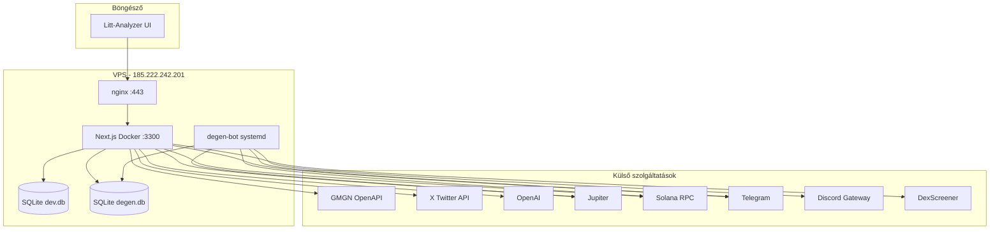

# Litt-Analyzer / trade-xelogpt — Teljes projekt leírás

> **Cél:** Ez a dokumentum egy fejlesztő számára készült handover anyag. Átadás után érteni kell, mit csinál a rendszer, hogyan működik technikailag, mi van kész, mi hiányzik, és hol vannak a kockázatok.
>
> **Éles URL:** https://trade.xelogpt.com  
> **GitHub:** https://github.com/compressedmonk/trade.xelogpt  
> **Utolsó frissítés:** 2026-06-26

---

## 1. Mi ez a projekt?

**Litt-Analyzer** egy személyes Solana meme-coin kereskedési terminál. A fő adatforrás a **GMGN.ai OpenAPI** — trending tokenek, trenches (új launchpad tokenek), smart money feed, token biztonság, KOL aktivitás.

A rendszer **nem egyetlen monolit bot**, hanem **négy független komponens**:

| Komponens | Hol fut | Mit csinál |
|-----------|---------|------------|
| **Web app** (Next.js) | Docker, port 3300 (localhost) → nginx HTTPS | UI, API, háttér loopok, dashboard |
| **degen-bot** | systemd, `/opt/degen-bot` | Discord CA sniper → Jupiter vétel → sweep |
| **liqwick-bot** | külön, nem integrált | Binance Futures — BTC regime + intrabar liq wick bot |
| **wg-discord-bot** | külön, legacy | Wealth Group Discord copy (nem ajánlott, helyette liqwick-bot) |

### Mit old meg a felhasználónak?

1. **Piaci áttekintés** — trending, trenches, smart money feed GMGN-ből
2. **Token elemzés** — biztonság, holderek, KOL aktivitás, chart, scoring (PASS/WATCH/SKIP)
3. **Saját KOL követés** — X (Twitter) említések + on-chain wallet aktivitás egy feedben
4. **Sentiment** — newsmaker KOL-ok tweetjeinek OpenAI osztályozása + makró mood index
5. **KOL auto-buy** — ha egy követett KOL wallet vásárol, Jupiter-rel tükrözi (opcionális)
6. **Manuális swap** — GMGN signed API-val buy/sell
7. **Degen bot dashboard** — Discord CA sniper bot read-only monitorozása
8. **Rendszer státusz** — API kulcsok, szerver terhelés, loop állapotok

---

## 2. Architektúra (magas szint)



### Adatfolyamok

**A) GMGN olvasás (unsigned)** — trending, trenches, token info, smart money, KOL listák  
**B) GMGN írás (signed)** — manuális swap a Copy Trade oldalon (`GMGN_PRIVATE_KEY` PEM)  
**C) KOL sync loop** — X API tweet fetch → SQLite cache → OpenAI classify → makró surge alert  
**D) KOL copy trader** — GMGN wallet activity poll → Jupiter buy → TradeLog  
**E) Degen bot** — Discord CA-only üzenet → profile lookup → Jupiter buy → sweep dest wallet → TG + SQLite

---

## 3. Technológiai stack

| Réteg | Technológia |
|-------|-------------|
| Frontend | Next.js 14 App Router, React 18, Tailwind CSS, client komponensek |
| Backend | Next.js API routes (Route Handlers) |
| Auth | Egyetlen jelszó (`APP_PASSWORD`) + JWT session cookie (`jose`) |
| App DB | Prisma + SQLite (`dev.db`) |
| Degen DB | better-sqlite3, read-only a web appból |
| Deploy | Docker multi-stage (standalone Next.js), nginx reverse proxy |
| Degen deploy | systemd service, Node 18+ + tsx |
| Nyelv | TypeScript (mindkét projekt) |

---

## 4. Repository struktúra

```
gmgncopy/
├── src/                    # Next.js web app
│   ├── app/                # Oldalak + API route-ok
│   ├── components/         # Nav, TokenTable, KlineChart
│   ├── lib/                # Üzleti logika, integrációk
│   └── middleware.ts       # JWT auth guard
├── prisma/schema.prisma    # App SQLite séma
├── degen-bot/              # Önálló Discord sniper (NINCS importálva a web appból)
├── liqwick-bot/            # Binance Futures regime + liq wick bot (nem része a fő appnak)
├── wg-discord-bot/         # Legacy Discord copy bot (nem része a fő appnak)
├── docs/                   # Dokumentáció
├── docker-compose.yml      # Csak a web app
├── Dockerfile
└── .env.example
```

**Fontos:** A `tsconfig.json` **kizárja** a `degen-bot/` mappát — a web app **nem importálhat** degen-bot modulokat. A dashboard env-ből olvassa a watch profilokat (`src/lib/degen-profiles.ts`), duplikált parse logikával.

---

## 5. Autentikáció és biztonság

### Bejelentkezés

- **Landing (`/`):** jelszó mező → `POST /api/auth/login` → JWT cookie (`session`)
- **Middleware:** minden route védett, kivéve `/` és `/api/auth/login`
- API auth nélkül: **401 JSON**
- Oldal auth nélkül: **redirect `/`**

### Korlátok

- **Egyetlen megosztott jelszó** — nincs multi-user, nincs RBAC
- **Login rate limit** — in-memory (`src/lib/rate-limit.ts`), restart után resetel
- **Nincs 2FA**

### VPS biztonság (2026-06-26 után)

- Docker portok **127.0.0.1** bind (nginx mögött)
- `.env` **kizárva** a Docker image-ből (`.dockerignore`)
- degen-bot `.env` **nincs mountolva** a web konténerbe (csak publikus env var-ok)
- SSH: root csak kulccsal, jelszó auth kikapcsolva

---

## 6. Navigáció és menüpontok

A navigáció forrása: `src/components/Nav.tsx`

| Menü (HU) | Route | Alapértelmezett landing |
|-----------|-------|-------------------------|
| Litt-Analyzer (logo) | `/mykols` | Igen (authed redirect is ide megy) |
| Saját KOL-ok | `/mykols` | |
| Sentiment | `/sentiment` | |
| Smart Money | `/smartmoney` | |
| Copy Trade | `/copytrade` | |
| Degen Bot | `/degen` | |
| Trending | `/trending` | |
| Trenches | `/trenches` | |
| Státusz | `/health` | |
| Kijelentkezés | POST `/api/auth/logout` | |

**Nincs a menüben:** `/token/[address]` — deep link a táblázatokból

---

## 7. Oldalankénti részletes leírás

### 7.1 Landing — `/`

**Fájl:** `src/app/page.tsx`

| Akció | Mit csinál |
|-------|------------|
| Jelszó megadása + Bejelentkezés | `POST /api/auth/login` — sikeres → redirect `/trending` (vagy `/mykols` ha már authed) |
| Authed user megnyitja | Automatikus redirect app-ba |

---

### 7.2 Saját KOL-ok — `/mykols`

**Fájl:** `src/app/(app)/mykols/MyKolsClient.tsx`  
**Cél:** A felhasználó **saját, kézzel választott** KOL listája — X említések + on-chain buy/sell feed.

#### Szekciók és akciók

| Szekció | Akció | API | Magyarázat |
|---------|-------|-----|------------|
| **KOL Auto-Buy Bot** | Státusz megjelenítés | `GET /api/bot/status` | Jupiter bot állapot: enabled, wallet, buy méret, slippage, utolsó poll |
| | **Poll most** gomb | `POST /api/bot/poll` | Manuális egy ciklus: GMGN wallet activity → Jupiter buy |
| **KOL hozzáadása** | @username + opcionális wallet → Hozzáad | `POST /api/kols` | Új `KolProfile` (type: `trader`), opcionális `KolWallet` |
| **Import panel** | Wallet seed tab | `GET /api/kols/wallet-seed` | Előre definiált Solana KOL wallet lista |
| | Összes import | `POST /api/kols/import-wallets` | Bulk import seed listából |
| | Egyedi import | `POST /api/kols` | Egy wallet seed sor hozzáadása |
| | Discover tab | `GET /api/kols/discover` | GMGN + seed alapú KOL felfedezés szűrőkkel |
| | Discover → hozzáad | `POST /api/kols` | Felfedezett KOL hozzáadása |
| **KOL lista** | Enable/disable toggle | `PATCH /api/kols` | `enabled` mező — auto-buy és feed szűrés |
| | Wallet feloldás | `POST /api/kols/resolve` | X handle → GMGN wallet lookup |
| | Wallet törlés | `PATCH /api/kols` | `removeWalletId` |
| | KOL törlés | `DELETE /api/kols` | Profil + walletek cascade delete |
| **Feed** | Automatikus frissítés | `GET /api/kols/feed` | Említés / buy / sell események, cluster jelzés |
| **KOL tokenek** | Token táblázat | `GET /api/kols/tokens` | Tokenek amiket a saját KOL-ok említettek/vásároltak |

#### KOL Auto-Buy Bot technikai működés

- **Loop:** `src/lib/kol-copy-trader.ts` — `instrumentation.ts`-ből indul
- **Engedélyezés:** `KOL_COPY_TRADE_ENABLED=true` (default: **false**)
- **Forrás:** `KolProfile` enabled walletjei (NEM a Copy Trade oldal wallet listája!)
- **Logika:** GMGN `getWalletActivity` → buy oldal → Jupiter swap fix SOL-lal (`KOL_COPY_TRADE_BUY_SOL`)
- **Dedup:** `ProcessedKolTrade` + 24h token cooldown
- **Log:** `TradeLog` source=`kol_copy`
- **TG alert:** vétel után Telegram értesítés

---

### 7.3 Sentiment — `/sentiment`

**Fájl:** `src/app/(app)/sentiment/SentimentClient.tsx`  
**Cél:** **Newsmaker** típusú KOL-ok tweetjeinek sentiment elemzése (trader KOL-októl külön).

| Akció | API | Magyarázat |
|-------|-----|------------|
| Makró mood index | `GET /api/kols/sentiment/macro` | Bullish/neutral/bearish index, momentum 1h/4h/24h, surge jelzés |
| Newsmaker feed | `GET /api/kols/feed?profileType=newsmaker` | Csak említések, OpenAI classify eredménnyel |
| Newsmaker hozzáadás | `POST /api/kols` | `profileType: newsmaker` |
| Seed import | `POST /api/kols/import-newsmakers` | Előre definiált newsmaker lista |
| Enable/disable | `PATCH /api/kols` | |
| Törlés | `DELETE /api/kols` | |
| Auto-refresh | 60 mp-enként | feed + macro |

#### Sentiment pipeline

1. **KOL sync loop** (`kol-sync-loop.ts`, default 60s):
   - `syncKolMentions()` — X API tweet fetch enabled newsmaker/trader profilokhoz
   - `classifyPendingPosts()` — OpenAI (`KOL_SENTIMENT_MODEL`, default `o3`)
   - `checkAndSendSurgeAlert()` — makró mood változás → Telegram

2. **Makró index** — súlyozott sentiment score az utolsó N classifikált tweetből

3. **Token sentiment** — `/api/kols/sentiment/token/[address]` (Token oldalon is megjelenik)

---

### 7.4 Smart Money — `/smartmoney`

**Fájl:** `src/app/(app)/smartmoney/SmartMoneyClient.tsx`  
**Adatforrás:** GMGN (SSR, 60s revalidate)

| Tab | GMGN endpoint | Mit mutat |
|-----|---------------|-----------|
| Smart Money | `getSmartMoney()` | Globális smart money trade feed |
| KOLs | `getKols()` | GMGN KOL trade feed |

| Oszlop | Tartalom |
|--------|----------|
| Time | trade timestamp |
| Wallet | maker cím + név/tag |
| Side | buy/sell |
| Token | symbol + link `/token/[address]` |
| Amount | USD |
| Price | USD |

**Megjegyzés:** Ez a **globális** GMGN feed, nem szűrve a saját KOL listára. Saját KOL-okhoz: `/mykols`.

---

### 7.5 Copy Trade — `/copytrade`

**Fájl:** `src/app/(app)/copytrade/CopyTradeClient.tsx`

#### Tab: Wallets (Followed Wallets)

| Akció | API | Mit csinál |
|-------|-----|------------|
| Wallet hozzáadás | `POST /api/copytrade` | `CopyTradeConfig` rekord: cím, label, maxPositionSol, slippage |
| Enable/disable | `PATCH /api/copytrade` | |
| Törlés | `DELETE /api/copytrade` | |

#### Tab: Logs

| Akció | API |
|-------|-----|
| Trade history | `GET /api/copytrade/logs` |

#### Tab: Manual Swap

| Akció | API | Mit csinál |
|-------|-----|------------|
| Buy/Sell | `POST /api/copytrade/swap` | GMGN **signed** swap API — token, side, amountSol, fromAddress |

**KRITIKUS HIÁNYOSSÁG:** A Followed Wallets lista **NINCS összekötve** semmilyen auto-copy loop-pal. A UI és DB létezik, de **senki nem olvassa** a `CopyTradeConfig` táblát háttérben. Az auto-buy a **My KOLs** oldalon van, `KolProfile` walletekből.

**További nem implementált mezők:** `autoTp`, `autoSl`, `maxPositionSol` — tárolva, de nem enforced.

---

### 7.6 Degen Bot — `/degen`

**Fájl:** `src/app/(app)/degen/DegenClient.tsx`  
**API:** `GET /api/degen/dashboard`  
**Adatforrás:** degen-bot SQLite (read-only) + Solana RPC + DexScreener

| Szekció | Tartalom |
|---------|----------|
| Hero | LIVE/DRY RUN badge, buy stats |
| Primary tárca | SOL balance, spendable, trigger méret (~full) |
| Extra tárca | SOL balance, ~30% trigger méret |
| Követett userek | Primary + extra profilok, buy rule |
| Dest portfólió | Sweepelt tokenek összértéke USD (DexScreener) |
| Sweepelt tokenek | PnL, buy/sweep tx linkek |
| Legutóbbi triggerek | author, tier, status, reason, latency |

**Frissítés:** 30 mp-enként auto-poll + manuális Frissítés gomb

**Nincs vezérlés:** read-only dashboard — a botot systemd-ből kell kezelni

---

### 7.7 Trending — `/trending`

**Fájl:** `src/app/(app)/trending/TrendingClient.tsx`  
**Adatforrás:** GMGN trending (SSR: 5m, 1h, 24h)

| Akció | Mit csinál |
|-------|------------|
| Interval váltás (5m/1h/24h) | Más trending lista |
| Signal filter (All/PASS/WATCH) | `scoreToken()` szűrés |
| Token sor kattintás | Navigate `/token/[address]` |

#### Scoring logika (`src/lib/scoring.ts`)

| Signal | Feltétel |
|--------|----------|
| **SKIP** | `rug_ratio > 0.3` VAGY wash trading VAGY honeypot |
| **PASS** | biztonságos + (smart_degen ≥ 3 VAGY renowned ≥ 2) |
| **WATCH** | biztonságos + kevesebb SM/KOL backing, vagy alapértelmezett |

---

### 7.8 Trenches — `/trenches`

**Fájl:** `src/app/(app)/trenches/TrenchesClient.tsx`  
**Adatforrás:** GMGN trenches (SSR, 15s revalidate)

| Tab | GMGN kategória | Jelentés |
|-----|----------------|----------|
| New | `new_creation` | Friss launchpad tokenek |
| Almost Bonded | `pump` | Közel bonding curve completion |
| Graduated | `completed` | Legraduált tokenek |

TokenTable komponens, scoring badge-ekkel.

---

### 7.9 Token részletek — `/token/[address]`

**Fájl:** `src/app/(app)/token/[address]/TokenDetail.tsx`  
**Adatforrás:** GMGN token info, security, holders, KOL traders, signals + saját KOL feed + token sentiment

| Szekció | Tartalom |
|---------|----------|
| Header | Ár, MC, likviditás, 24h változás |
| Security | Rug ratio, honeypot, wash, mint/freeze authority, top holder % |
| Chart | KlineChart — `GET /api/kline?address=&resolution=` |
| Holders | Top holder lista |
| KOL Traders | GMGN KOL-ok akik tradelik |
| Saját KOL aktivitás | A user KOL listájából említés/trade |
| Token Sentiment | Newsmaker tweetek sentiment score-ja |
| Signals | GMGN signal feed (price spike, SM buy, stb.) |
| Dev / Links | Social linkek, dev stat |

---

### 7.10 Státusz — `/health`

**Fájl:** `src/app/(app)/health/HealthClient.tsx`  
**API:** `GET /api/health` (30s auto-refresh)

| Blokk | Mit mutat |
|-------|-----------|
| Szerver | CPU, RAM, uptime, load |
| Adatbázis | SQLite elérhetőség |
| GMGN API | Kulcs érvényesség |
| X (Twitter) API | Bearer token, rate limit |
| OpenAI | API key, credit balance (admin key) |
| Telegram | Bot token, chat ID |
| Loop státuszok | KOL sync, KOL copy trader, API health alert |
| KOL sync | Utolsó sync, classified/failed count |

**Háttér:** `api-health-alerts.ts` — 5 percenként probe, TG alert hiba/recovery esetén

---

## 8. API route referencia (összes)

### Auth
- `POST /api/auth/login` — jelszó → JWT cookie
- `POST /api/auth/logout` — cookie törlés

### Market
- `GET /api/kline` — OHLCV chart adat

### Copy Trade
- `GET/POST/PATCH/DELETE /api/copytrade` — CopyTradeConfig CRUD
- `GET /api/copytrade/logs` — TradeLog utolsó 100
- `POST /api/copytrade/swap` — GMGN signed manual swap

### KOL
- `GET/POST/PATCH/DELETE /api/kols` — KolProfile + KolWallet CRUD
- `GET /api/kols/feed` — unified feed
- `GET/POST /api/kols/sync` — sync loop status / manual trigger
- `GET /api/kols/tokens` — KOL token aggregátum
- `GET /api/kols/discover` — KOL discovery
- `POST /api/kols/resolve` — handle → wallet
- `POST /api/kols/import-wallets` — seed import
- `GET /api/kols/wallet-seed` — seed lista
- `GET/POST /api/kols/import-newsmakers` — newsmaker seed

### Sentiment
- `GET /api/kols/sentiment/macro` — makró index
- `GET /api/kols/sentiment/token/[address]` — per-token sentiment

### Bot
- `GET /api/bot/status` — KOL auto-buy status
- `POST /api/bot/poll` — manual poll

### Degen
- `GET /api/degen/dashboard` — wallets, profiles, positions, buys

### Health
- `GET /api/health` — full snapshot

### Telegram (webhook bot)
- `POST /api/telegram` — `/start`, `/trending`, `/check`, `/price`, `/id` parancsok
- `GET /api/telegram/setup` — webhook regisztráció
- `POST /api/telegram/notify` — manuális alert küldés

---

## 9. Háttér loopok

Mind a `src/instrumentation.ts`-ből indulnak (Node.js runtime, Docker container boot):

| Loop | Fájl | Interval | Default | Mit csinál |
|------|------|----------|---------|------------|
| KOL Sync | `kol-sync-loop.ts` | `KOL_SYNC_POLL_MS` | 60s | Tweet sync + OpenAI classify + surge alert |
| KOL Copy Trader | `kol-copy-trader.ts` | `KOL_COPY_TRADE_POLL_MS` | 30s | KOL wallet buy mirror (Jupiter) |
| API Health Alerts | `api-health-alerts.ts` | `API_HEALTH_CHECK_MS` | 5min | X + OpenAI probe → TG |

**degen-bot** (külön process):
- Discord Gateway WebSocket — real-time CA listen
- Balance watcher — 30s poll, TG értesítés primary + extra tárcára

---

## 10. degen-bot — részletes architektúra

**Hely:** `/opt/degen-bot` (VPS), systemd unit: `degen-bot.service`  
**User:** `degen` (dedikált system user)

### Flow

```
Discord MESSAGE_CREATE (DEGEN_CHANNEL_ID)
  → ca-filter: csak CA-only üzenet (32-44 base58, nincs embed/attachment)
  → watched user check (primary + extra user ID-k)
  → SQLite claim (discord_msg_id UNIQUE — dedup)
  → Telegram: CA találat alert
  → buyForProfile(mint, profile)
      → primary: full spendable balance - gas reserve
      → extra: floor(spendable × buyFraction), skip if < minBuySol
  → Jupiter quote + swap
  → sweepTokenToDest → DEGEN_DEST_WALLET
  → Telegram: vétel + sweep eredmény
  → SQLite: buys + sweeps táblák
```

### Watch profilok

| Tier | Env | Wallet | Buy rule |
|------|-----|--------|----------|
| **Primary** | `DEGEN_WATCH_USER_ID` | `DEGEN_WALLET_PRIVATE_KEY` | Teljes spendable (minus `DEGEN_GAS_RESERVE_SOL`) |
| **Extra** | `DEGEN_EXTRA_WATCH` | `DEGEN_EXTRA_WALLET_PRIVATE_KEY` (shared) | `userId:buyFraction` pl. `0.3` = 30% |

Extra watch formátum:
```
779205885683171340:0.3|189920943101968386:0.3|863385070261239828:0.3
```

### CA filter szabályok (`ca-filter.ts`)

- Csak a konfigurált Discord csatorna
- Csak watched user ID-k
- Üzenet tartalma **kizárólag** a CA (base58, 32-44 char)
- Nincs embed, nincs attachment
- Wrapped SOL mint kizárva
- **NEM ellenőrzi** hogy a mint létezik-e — Jupiter quote fail = nincs vétel

### SQLite séma (`degen.db`)

| Tábla | Cél |
|-------|-----|
| `buys` | Minden trigger: status (bought/error/skipped/dry_run), sol_spent, author_id, latency |
| `sweeps` | Sweepelt tokenek: amount, dest, tx signatures |
| `events` | Audit log |

### Telegram értesítések

- Boot üzenet (profilok listája)
- CA találat
- Vétel OK / hiba / skip
- Sweep eredmény
- Egyenleg változás (primary + extra, 30s poll)
- Boot snapshot (mindkét tárca egyenlege induláskor)

### Deploy

```bash
rsync degen-bot/ → /opt/degen-bot/
chown degen:degen
systemctl restart degen-bot
```

Scriptek: `wallet:balance`, `wallet:new`, `wallet:new-extra`, `wallet:add-extra`, `test:buy`, `sweep`

---

## 11. Adatbázis sémák (Prisma — web app)

**Fájl:** `prisma/schema.prisma`  
**Path:** `file:./dev.db` (Docker: `/app/data/dev.db`)

| Model | Használat | Státusz |
|-------|-----------|---------|
| `Watchlist` | Token watchlist | **NEM HASZNÁLT** — csak séma |
| `Alert` | Price alert | **NEM HASZNÁLT** — csak séma |
| `CopyTradeConfig` | Copy Trade UI wallet lista | **UI only** — nincs auto-copy loop |
| `TradeLog` | Manual swap + KOL auto-buy log | **AKTÍV** |
| `ProcessedKolTrade` | KOL auto-buy dedup | **AKTÍV** |
| `KolProfile` | KOL profilok (trader/newsmaker) | **AKTÍV** |
| `KolWallet` | KOL-hoz linkelt wallet | **AKTÍV** |
| `KolMentionCache` | Tweet cache + OpenAI classify | **AKTÍV** |

---

## 12. Külső integrációk

| Szolgáltatás | Hol | Mire |
|--------------|-----|------|
| **GMGN OpenAPI** | `gmgn-client.ts`, `gmgn-signer.ts` | Piaci adat + signed swap |
| **Jupiter** | `jupiter-swap.ts` (web), `buy-all.ts` (degen) | On-chain swap |
| **Solana RPC** | `@solana/web3.js` | Balance, tx send |
| **X / Twitter** | `twitter-client.ts` | Tweet sync, user lookup |
| **OpenAI** | `kol-sentiment-classifier.ts` | Tweet classify |
| **Telegram** | `telegram.ts` (web + degen) | Alertek |
| **Discord** | degen-bot gateway | CA sniper (user token!) |
| **DexScreener** | `dexscreener.ts` | Degen dashboard pricing |

---

## 13. Environment változók

### Web app (`.env.example`)

| Változó | Kötelező | Cél |
|---------|----------|-----|
| `APP_PASSWORD` | Igen | Login jelszó |
| `SESSION_SECRET` | Igen | JWT signing |
| `GMGN_API_KEY` | Igen | GMGN olvasás |
| `GMGN_PRIVATE_KEY` | Swap-hoz | PEM, signed GMGN endpoints |
| `DATABASE_URL` | Igen | SQLite path |
| `TWITTER_BEARER_TOKEN` | KOL sync-hez | X API |
| `OPENAI_API_KEY` | Sentiment-hez | Classify |
| `TELEGRAM_BOT_TOKEN/CHAT_ID` | Alertekhez | |
| `KOL_SYNC_*` | | Tweet sync loop |
| `KOL_COPY_TRADE_*` | | Auto-buy (default off) |
| `DEGEN_*` | Dashboard-hoz | Publikus címek, watch ID-k |
| `SOLANA_RPC_URL` | Auto-buy-hoz | |
| `TRADING_WALLET_PRIVATE_KEY` | Auto-buy-hoz | KOL bot wallet |

### degen-bot (`.env.example`)

| Változó | Cél |
|---------|-----|
| `DISCORD_USER_TOKEN` | Discord gateway (user token — fragile!) |
| `DEGEN_CHANNEL_ID` | Figyelt csatorna |
| `DEGEN_WATCH_USER_ID` | Primary user Discord snowflake |
| `DEGEN_EXTRA_WATCH` | Extra userek + fraction |
| `DEGEN_WALLET_PRIVATE_KEY` | Primary bot wallet |
| `DEGEN_EXTRA_WALLET_PRIVATE_KEY` | Shared extra wallet |
| `DEGEN_DEST_WALLET` | Sweep cél (Phantom) |
| `SOLANA_RPC_URL` | |
| `DRY_RUN` | true/false |
| `TELEGRAM_BOT_TOKEN/CHAT_ID` | |

---

## 14. Deploy (VPS)

### Web app

```bash
# Lokál → VPS
rsync → /root/soltrade/
docker compose build --no-cache
docker compose up -d
```

- **Port:** `127.0.0.1:3300:3000`
- **nginx:** `trade.xelogpt.com` → `127.0.0.1:3300`
- **Volume:** `dbdata` (SQLite), `/opt/degen-bot/data` (read-only degen.db)

### degen-bot

```bash
rsync degen-bot/ → /opt/degen-bot/  (exclude .env, data)
systemctl restart degen-bot
```

---

## 15. Ismert hiányosságok, hibák, kockázatok

### Funkcionális hiányosságok

| # | Probléma | Súlyosság | Részletek |
|---|----------|-----------|-----------|
| 1 | **Copy Trade Followed Wallets nincs auto-copy** | Magas | UI + DB létezik, de nincs háttér loop. Félrevezető a felhasználónak |
| 2 | **autoTp / autoSl / maxPositionSol** | Közepes | CopyTradeConfig mezők tárolva, sehol nem enforced |
| 3 | **Watchlist + Alert model** | Alacsony | Prisma séma, zero kód |
| 4 | **Nincs root README** | Alacsony | Csak docs/ és részleges USER_GUIDE |
| 5 | **Token oldal nincs menüben** | Info | Szándékos deep link |
| 6 | **Magyar-only UI** | Info | Nincs i18n |
| 7 | **Egyetlen jelszó auth** | Közepes | Nincs multi-user |

### degen-bot kockázatok

| # | Probléma | Részletek |
|---|----------|-----------|
| 1 | **Discord user token** | Discord ToS szürke zóna; token lejár/invalidálódhat; manuális refresh kell |
| 2 | **Nincs honeypot/rug pre-check** | CA format + Jupiter quote az egyetlen védelem |
| 3 | **Full send primary** | Egy rossz trigger = teljes primary wallet elköltése |
| 4 | **Extra wallet shared** | 3 user egymás után triggerel → gyorsan fogy az extra SOL |
| 5 | **Sweep fail** | Token a bot tárcán marad, manuális sweep kell |

### Technikai adósság

| # | Probléma |
|---|----------|
| 1 | `degen-profiles.ts` duplikálja a degen-bot parse logikát (tsconfig exclude miatt) |
| 2 | Hardcoded `https://trade.xelogpt.com` Telegram webhook setup-ban |
| 3 | In-memory rate limit — restart = reset |
| 4 | `public/` mappa üres — nincs favicon |
| 5 | wg-discord-bot teljesen külön — nincs dokumentálva a fő appban |

### Biztonság (post-audit, 2026-06-26)

| # | Státusz |
|---|---------|
| Docker .env bake | **Javítva** (.dockerignore) |
| Publikus Docker portok | **Javítva** (localhost bind) |
| .env fájl jogosultságok | **Javítva** (600) |
| Discord token rotáció | **Függőben** — user nem tudott újat csinálni |
| APP_PASSWORD | **Erősítve** (24 char random) |

---

## 16. Gyors referencia — mi melyik walletet használja?

| Funkció | Wallet env | Publikus cím env |
|---------|-----------|------------------|
| Degen primary buy | `DEGEN_WALLET_PRIVATE_KEY` | `DEGEN_BOT_WALLET` |
| Degen extra buy | `DEGEN_EXTRA_WALLET_PRIVATE_KEY` | `DEGEN_EXTRA_BOT_WALLET` |
| Degen sweep cél | — | `DEGEN_DEST_WALLET` |
| KOL auto-buy | `TRADING_WALLET_PRIVATE_KEY` | (derived runtime) |
| Manual GMGN swap | User megadja `fromAddress`-t | — |

---

## 17. Fejlesztői onboarding checklist

1. Klónozd a repót, másold `.env.example` → `.env`
2. `npm ci && npx prisma db push && npm run dev`
3. Állítsd be: `APP_PASSWORD`, `GMGN_API_KEY`, `SESSION_SECRET`
4. KOL sync-hez: `TWITTER_BEARER_TOKEN`, `OPENAI_API_KEY`
5. Auto-buy-hoz: `KOL_COPY_TRADE_ENABLED=true`, `SOLANA_RPC_URL`, `TRADING_WALLET_PRIVATE_KEY`
6. Degen dashboard-hoz: `DEGEN_DB_PATH`, wallet címek, watch ID-k
7. degen-bot: külön `cd degen-bot && cp .env.example .env` — külön process
8. Olvasd el: `docs/USER_GUIDE_HU.md`, `docs/DISCORD_CA_SEARCH_HU.md`

---

## 18. Kapcsolódó dokumentumok

| Fájl | Tartalom |
|------|----------|
| `docs/USER_GUIDE_HU.md` | Trending, Trenches, Token, Smart Money, Copy Trade user guide |
| `docs/DISCORD_CA_SEARCH_HU.md` | Discord CA keresés + degen filter szabályok |
| `degen-bot/.env.example` | Degen bot env referencia |
| `.env.example` | Web app env referencia |
| `liqwick-bot/README.md` | Binance Futures LiqWick bot — regime + intrabar liq wick |
| `wg-discord-bot/README.md` | Legacy Discord copy bot (nem része a fő appnak) |

---

*Ez a dokumentum a repository aktuális állapotát tükrözi. Ha új feature kerül be, frissíteni kell.*
